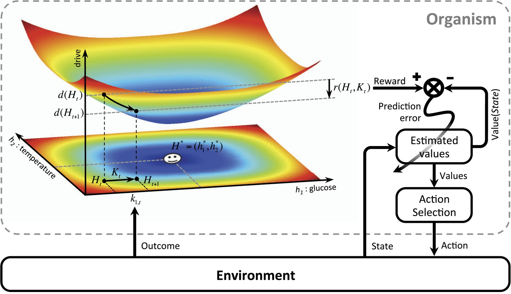

# Experiment 3: linking to Homeostatic Reinforcement Learning
Homeostasis refers to the process of self-regulating the internal states of an organism by it, such that
the internal states are maintained within a certain range. [Homeostatic reinforcement learning](https://elifesciences.org/articles/04811) bridges the gap between the associative and homeostatic learning process by proving that seeking reward is equivalent to the fundamental objective of physiological stability. The HRL framework is summarized below.  

In the context of this experiment, the energy in the virtual energy tank is considered as the internal homeostatic state and the reward function is defined for maximizing this energy.

