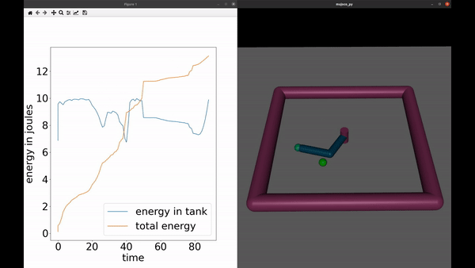

## Experiment 1: A proof of concept
In this experiment a 2 DOF planar robot learns to track a moving target. The energy in the virtual energy tank associated with the 2 motors is always maintained below an emperically set, energy safety threshold of 10J. In the beginning of each trial, the target is initialized with a random angular velocity around the robot and at a random location, hence, the total task energy required for the trial is unknown. However, by virtue of the selective passivity property provided by the framework the robot is able to recharge the energy tank with new energy if it keeps moving towards the target. Now, if fixed obstacles are introduced in the arena and the robot tries to exert force against them, then by virtue of the same selectve passivity property the robot is  unable to release more than 10J of energy in a single timestep thus providing safety.   

